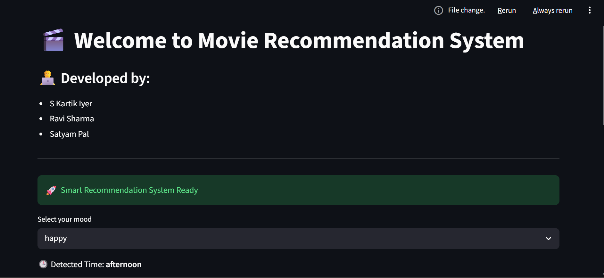
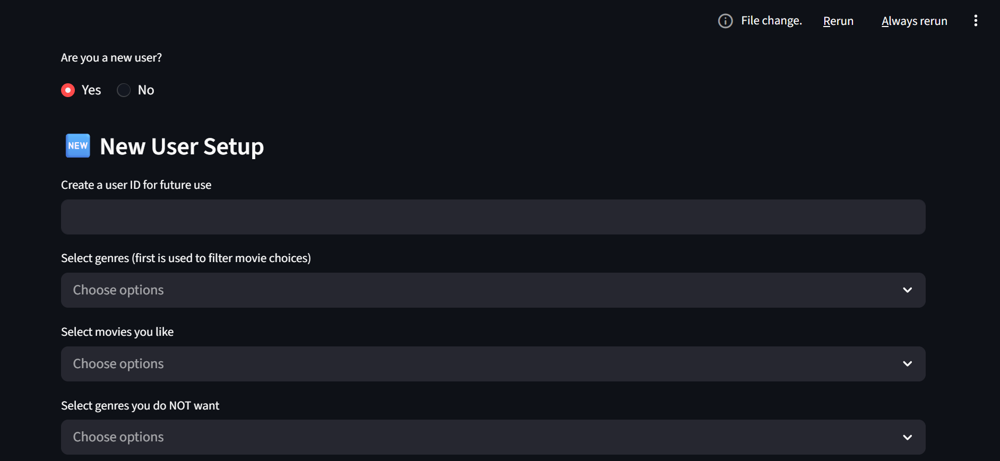
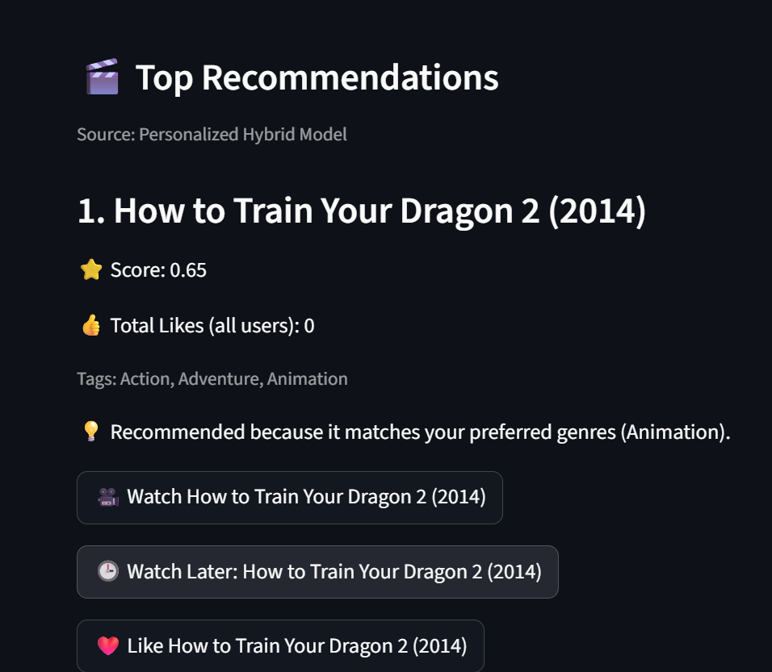

# 🎬 Context-Aware Movie Recommendation System

A scalable hybrid movie recommendation system that combines **Collaborative Filtering (ALS)**, **Content-Based Filtering**, and **Context-Aware Personalization** to deliver accurate, diverse, and explainable movie recommendations.

Built as part of the **M.Tech Artificial Intelligence program at IIT Jodhpur**, the system leverages Apache Spark for large-scale processing and Streamlit for an interactive user experience.

---

## 🚀 Key Features

### Hybrid Recommendation Engine
- ALS-based Collaborative Filtering using Apache Spark MLlib
- Content-Based Filtering using TF-IDF and Cosine Similarity
- Hybrid scoring mechanism combining both approaches

### Context-Aware Personalization
- Mood-based recommendations (Happy, Serious, Excited, etc.)
- Time-of-day adaptation (Morning, Afternoon, Evening, Night)
- Personalized ranking based on user preferences

### User Profiling & Cold-Start Handling
- New user onboarding through favorite genres and movies
- Stored user profiles for returning users
- Cold-start recommendations using content features and preferences

### Real-Time Feedback Learning
- Tracks likes, watch history, and watch-later interactions
- Dynamically updates user profiles
- Continuously improves recommendation quality

### Explainable Recommendations
Provides human-readable explanations such as:
- Similar to previously liked movies
- Matches preferred genres
- Matches current mood
- Popular and highly-rated content

### Diversity Optimization
- Diversity-aware re-ranking mechanism
- Reduces repetitive recommendations
- Improves genre coverage and recommendation variety

### Big Data Scalability
- Processes datasets containing 32M+ ratings
- Distributed processing using Apache Spark
- Efficient ALS training and evaluation
- Optimized storage using Parquet format

---

# Dataset

Dataset used:

**MovieLens 32M Dataset**

- Movies: 87,600+
- Ratings: 32,000,000+
- Large-scale user interaction data

Dataset Source:

https://grouplens.org/datasets/movielens/32m/

---

# System Architecture

The recommendation pipeline consists of:

1. Data Preprocessing
2. Feature Engineering
3. Content-Based Recommendation
4. ALS Collaborative Filtering
5. Context-Aware Hybrid Ranking
6. Diversity Re-Ranking
7. Explainability Module
8. User Profile Management
9. Streamlit User Interface

### Architecture Flow

Raw Data
→ Spark Processing
→ Feature Engineering
→ Content-Based Model
→ ALS Collaborative Filtering
→ Hybrid Context-Aware Model
→ Diversity Optimization
→ Explainability Layer
→ Streamlit UI
→ Personalized Recommendations

---

# User Interface

## Home Screen



Features:
- Mood selection
- Time-aware recommendations
- User registration/login
- Interactive recommendation interface

---

## New User Registration



Users can:

- Create a profile
- Select preferred genres
- Choose favorite movies
- Specify disliked genres

---

## Recommendation Results




Each recommendation includes:

- Recommendation score
- Genres
- Explanation
- Watch option
- Like option
- Watch Later option

---

# Evaluation Metrics

The system was evaluated on a representative subset of the MovieLens 32M dataset.

| Metric | Value |
|----------|----------|
| Precision@10 | 0.318 |
| Recall@10 | 0.187 |
| NDCG@10 | 0.355 |
| Genre Coverage | 10.1 |
| Evaluation Time | ~889 seconds |

### Key Observations

- Approximately 31% of Top-10 recommendations were relevant.
- Strong recommendation diversity achieved through re-ranking.
- Personalized recommendations adapt to user preferences.
- Apache Spark enables scalable processing of large datasets.

---

# Tech Stack

### Programming Languages
- Python

### Machine Learning
- Apache Spark MLlib
- ALS (Alternating Least Squares)
- TF-IDF Vectorization
- Cosine Similarity

### Data Processing
- Pandas
- NumPy
- Parquet

### Web Application
- Streamlit

### Big Data Technologies
- Apache Spark
- Distributed Processing

---

# Project Structure

```text
movie-recommender-system/
│
├── api/
├── data/
│   └── processed/
│
├── src/
│
├── app.py
├── main.py
├── evaluation.py
├── requirements.txt
├── README.md
└── project_report.pdf
```

# Installation

Clone repository

```bash
git clone <repository-url>
cd movie-recommender-system
```

Create virtual environment

```bash
python -m venv venv
```

Activate environment

Windows:

```bash
venv\Scripts\activate
```

Linux/Mac:

```bash
source venv/bin/activate
```

Install dependencies

```bash
pip install -r requirements.txt
```

# ▶ Running the Application

Launch Streamlit UI

```bash
streamlit run app.py
```

---

# Spark ALS Pipeline

Run scalable collaborative filtering pipeline

```bash
python src/spark/run_als.py \
--ratings data/raw/ratings.csv \
--movies data/raw/movies.csv
```

Generated recommendations are stored in:

```text
data/processed/als_recommendations/
```

---

# Future Improvements

- Neural Collaborative Filtering
- Transformer-Based Recommendations
- BERT Movie Embeddings
- Kafka Streaming Integration
- Session-Based Recommendations
- Multi-Modal Features (Posters, Reviews, Trailers)
- Advanced Ranking Optimization
- Real-Time Recommendation Updates

---

# Authors

- S Kartik Iyer
- Ravi Sharma
- Satyam Pal

Department of Computer Science and Engineering

Indian Institute of Technology Jodhpur

---

# License

This project is intended for educational and research purposes.